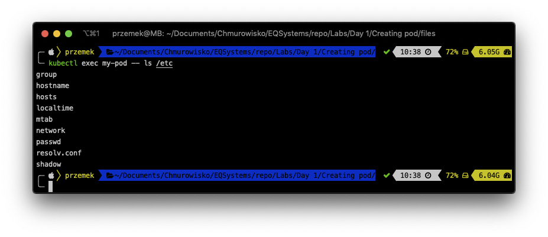

<br><br>
<br><br>
<br><br>

# Creating pod

## LAB Overview

#### In this lab you will create a Kubernetes pod

## Task 1: Checking kubectl and cluster status

1. Open a terminal of your choice.
2. Type `kubectl version` and press **Enter**.
   You should get an output similiar to:

`Client Version: version.Info{Major:"1", Minor:"14", GitVersion:"v1.14.3", GitCommit:"5e53fd6bc17c0dec8434817e69b04a25d8ae0ff0", GitTreeState:"clean", BuildDate:"2019-06-06T01:44:30Z", GoVersion:"go1.12.5", Compiler:"gc", Platform:"darwin/amd64"} Server Version: version.Info{Major:"1", Minor:"14", GitVersion:"v1.14.6", GitCommit:"96fac5cd13a5dc064f7d9f4f23030a6aeface6cc", GitTreeState:"clean", BuildDate:"2019-08-19T11:05:16Z", GoVersion:"go1.12.9", Compiler:"gc", Platform:"linux/amd64"} `

3. To check if there are any nodes available, eype `kubectl get nodes` and press **Enter**.
   You should get at least one node.

## Task 2. Creating a pod.

In this task you will create your simple pod using CLI.

1. Still in the terminal type
   ` kubectl run my-nginx --restart=Never --image=nginx:1.7.9` and press **Enter**.
2. Check if there is any pod created by typing: `kubectl get pods`.
   You should get at least one pod running.
   

## Task 3. Editing and getting pod details.

1. Type `kubectl describe pods my-nginx` and press **Enter**.
   Look into pod details.
2. Export pod definition by typing: `kubectl get pod my-nginx -o yaml > my_pod_definition.yaml`
3. Check if there is a definition by typing `ls` and pressing **Enter**.
4. You can examine the definition by typing `cat my_pod_definition.yaml`.
5. Edit existing pod by typing `kubectl edit pod my-nginx`.
   Pod definition should open in an editor. Edit the file by replacing line:
   `- image: nginx:1.7.9` with `- image: nginx:1.9.1` and saving the file.
6. Check if pod is updated by typing `kubectl describe pod my-nginx`. The pod should use new docker image now.
7. Make a proxy connection to your pod by typing:
   `kubectl port-forward my-nginx 8080:80`
   Now you should be able to connect to the pod using a web browser or curl. `http://localhost:8080`
8. Delete pod by typing `kubectl delete pod my-nginx --grace-period=1`.

## Task 4. Creating and editing a pod using manifest file.

1. Create new file by typing `nano pod_definition.yaml`.
2. Download [manifest file](./files/pod_definition.yaml) and paste its content into editor.
3. Save changes by pressing _CTRL+O_ and _CTRL-X_.
4. Type `kubectl create -f pod_definition.yaml` and press enter.
5. Check if there is a pod created by typing `kubectl get pods`.
6. If you have your pod created, edit the manifest file by typing `nano pod_definition.yaml`.
7. Replace lines:

```
labels:
  app: myapp
```

with

```
labels:
  app: myapp-2
```

and save the file. 8. Type `kubectl apply -f pod_definition.yaml` and press **Enter**. 9. Describe the pod by typing `kubectl describe pod my-pod` and check if the definition has changed.


## Task 5. Examining pod logs and running a command inside the pod.

There is a command _['sh', '-c', 'echo Welcome to Kubernetes! && sleep 3600'] _ in the pod definition. The pod should write _'Welcome to Kubernetes!'_ to the logs. Let's see.

1. Type `kubectl logs my-pod` and press **Enter**.
   

You can also run commands inside a pod.

2. Type `kubectl exec my-pod -- ls /etc`
   

And you can even connect to a pod if it has any shell inside the container.

3. Type `kubectl exec my-pod -it -- /bin/sh` and press **Enter**.
   Now you can execute commands inside a container.
   

4. Delete the pod by executing following command:
   `kubectl delete pod my-pod --grace-period=1`

## END LAB

<br><br>

<center><p>&copy; 2021 Chmurowisko Sp. z o.o.<p></center>
