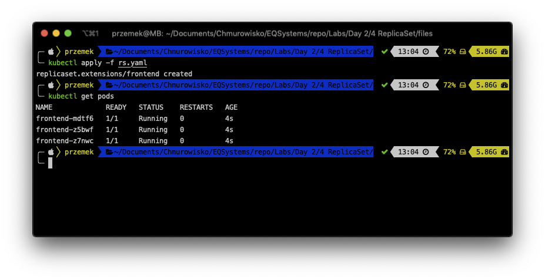
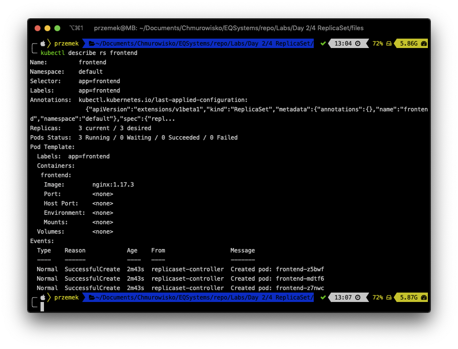
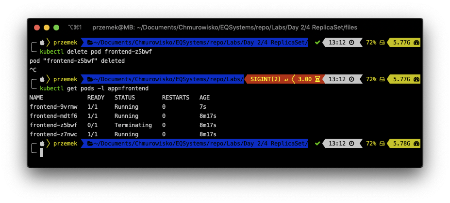
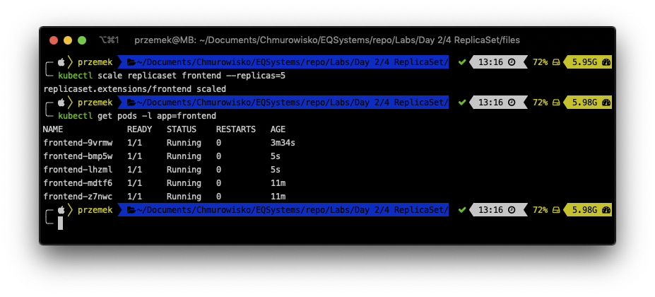

<br><br>
<br><br>
<br><br>

# ReplicaSet

## LAB Overview

In this lab you will work with a ReplicaSet

## Task 1: Creating a ReplicaSet

1. Download the [manifest file](./files/rs.yaml) and save it on your machine.
1. In terminal type `kubectl create -f rs.yaml` and press enter.
1. Using `kubectl get pods`, check if Kubernetes created a new pod.



## Task 2: Inspecting ReplicaSet and its behaviour

1. Execute following command:

   ```bash
   kubectl describe rs frontend
   ```

   

   You can see the label selector for the ReplicaSet, as well as the state of all of the replicas managed by the ReplicaSet.

1. Once again get a list of pods inside the replica `kubectl get pods -l app=frontend`
1. Execute the following command `kubectl delete pod <POD-NAME>` but replace _<POD-NAME>_ with one of the pod's name, i.e.: `kubectl delete pod frontend-z5bwf`.
1. Get a list of pods `kubectl get pods -l app=frontend`

   

   As you can see, ReplicaSet still have 3 running pods.

## Task 3: Scaling ReplicaSet

You can scale ReplicaSet using declarative way by changing manifest file. But you can also do it imperative way.

1. Execute following command:
   `kubectl scale replicaset frontend --replicas=5`
2. Get a list of pods `kubectl get pods -l app=frontend`
   
   Now you should have 5 pods running inside ReplicaSet.

## Task 4: Detach replica set from pods

1. You can delete replica set without deleting the pods. Execute: `kubectl delete rs frontend --cascade=orphan`
2. Run: `kubectl get pods -l app=frontend` and see that there are still 5 pods created by replica set.
3. Delete one of the pod: `kubectl delete pod POD_NAME`. This pod won't be recreated so there will be 4 pods left. Verify it: `kubectl get pods -l app=frontend`
4. Create the replica set again: `kubectl create -f rs.yaml`.
5. Now all 4 pods will be again managed by replica set. In .yaml definition there are 3 replicas so one pod will be deleted. Execute: `kubectl get pods -l app=frontend`
6. Delete the replicaset by executing following command:
   `kubectl delete rs frontend`
7. Now all the pods managed by replica set should be deleted.

## END LAB

<br><br>

<center><p>&copy; 2019 Chmurowisko Sp. z o.o.<p></center>
